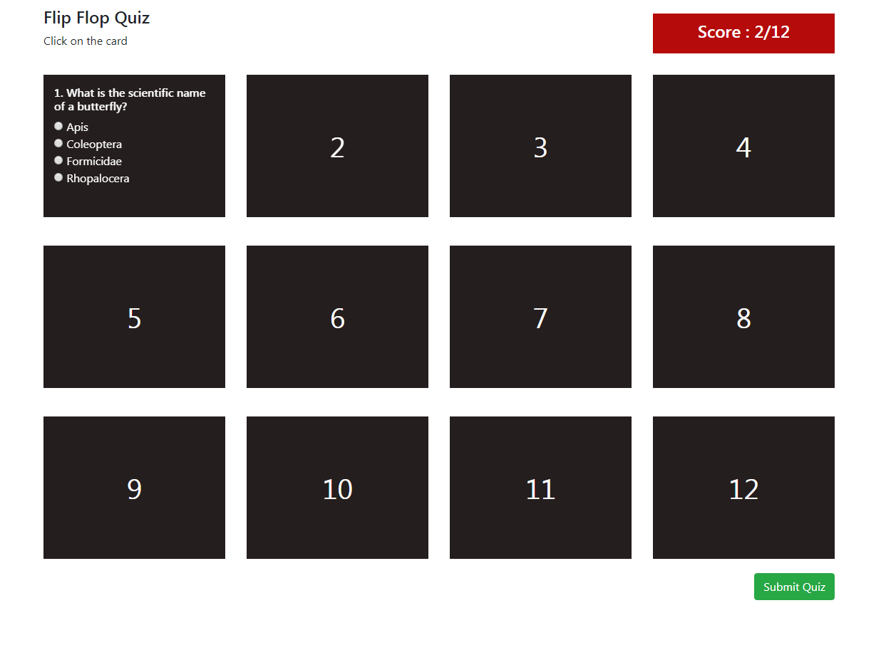

# flipflop Quiz game

create an Interface class for Quiz data by running following command defining the type of values for quiz.

# Helpfull Tutorials
https://dzone.com/articles/how-to-dynamically-create-a-component-in-angular
https://github.com/softgandhi/ng2-quiz/blob/master/src/app/quiz/quiz.component.ts

# Live URL
https://piyalidas10.github.io/flipflop-quiz/

```
ng generate class models/Quiz
```

# Run Application
```
ng serve
localhost:4200/
```



# Dynamically Create a Component in Angular

I have a component "Quizexpand" which you want to load dynamically from "Quizhome" component. To load "Quizexpand" you need a container inside 
"Quizhome" component.
The template for QuizhomeComponent is as below:

```
<div class="flip-card-back" (click)="closeSection(startIndex)">
    <ng-template #quizcontainer>
    </ng-template>
</div>
```

As you can see, we have an entry point template or a container template in which we will load QuizexpandComponent dynamically.
In QuizhomeComponent, we need to import the following:

 1. ViewChild, ViewContainerRef, and ComponentFactoryResolver from @angular/core. 
 2. ComponentRef and ComponentFactory from @angular/core. 
 3. QuizexpandComponent from quizexpand.component.

We can access template using ViewChild inside the Component class. The template is a container in which we want to load the component dynamically. Therefore, we have to access template with ViewConatinerRef.

ViewContainerRef represents a container where one or more views can be attached. This can contain two types of views.

Host Views are created by instantiating a component using createComponent and Embedded Views are created by instantiating an Embedded Template usingcreateEmbeddedView. We will use Host Views to dynamically load QuizexpandComponent.

Let us create a variable called entry which will refer to the template element. In addition, we have injected ComponentFactoryResolver services to the component class, which will be needed to dynamically load the component.

```
@ViewChild('quizcontainer', { read: ViewContainerRef, static: true }) entry: ViewContainerRef;
```

Keep in mind that the entryvariable, which is a reference to a template element, has an API to create components, destroy components, etc.

To create a component, let us first create a function. Inside the function, we need to perform the following tasks:

1. Clear the container.
2. Create a factory for QuizexpandComponent.
3. Create a component using the factory.
4. Pass the value for @Input properties using a component reference instance method.
5. Putting everything together, the openComponent function will look like the below code:

Putting everything together, the openComponent function will look like the below code:

```
openComponent(index) {
    this.entry.clear();
    console.log('openComponent entry => ', this.entry);
    const alreadyChoosedAns = this.showAlreadySelectedAns(index);
    console.log('alreadyChoosedAns => ', alreadyChoosedAns);
    const myFactory = this.resolver.resolveComponentFactory(QuizexpandComponent);
    this.myRef = this.entry.createComponent(myFactory);
    this.myRef.instance['data'] = this.quizLists[index];
    this.myRef.instance['serialno'] = index;
    this.myRef.instance['alreadychoosedans'] = alreadyChoosedAns;
    this.myRef.instance['chooseVal'].subscribe(event => {
      console.log('chooseVal => ', event);
      this.checkDuplicateAns(event);
    });
    this.myRef.changeDetectorRef.detectChanges();
}
```
click on "expandSection" function this "openComponent" function will be called.

You can destroy a component using the destroy method on the myRef.

```
closeComponent(index) {
    console.log('close component', index);
    this.myRef.destroy();
}
```

At this point, when running the application, you will get an error because we have not set the entryComponents in AppModule. We can set that as shown in the listing below:

```
import { BrowserModule } from '@angular/platform-browser';
import { NgModule, CUSTOM_ELEMENTS_SCHEMA } from '@angular/core';
import { HttpClientModule } from '@angular/common/http';
import { CommonModule } from '@angular/common';
import { ReactiveFormsModule } from '@angular/forms';

import { AppComponent } from './app.component';
import { QuizhomeComponent } from './quizhome/quizhome.component';
import { QuizexpandComponent } from './quizexpand/quizexpand.component';

import { ApiService } from './services/api.service';

// import { QuizcontainerDirective } from './quizhome/quizhome.component';
import { QuizresultComponent } from './quizresult/quizresult.component';

@NgModule({
  declarations: [
    AppComponent,
    QuizhomeComponent,
    // QuizcontainerDirective,
    QuizexpandComponent,
    QuizresultComponent
  ],
  imports: [
    BrowserModule,
    CommonModule,
    HttpClientModule,
    ReactiveFormsModule
  ],
  schemas: [
    CUSTOM_ELEMENTS_SCHEMA
  ],
  providers: [ApiService],
  entryComponents: [
    QuizexpandComponent
  ],
  bootstrap: [AppComponent]
})
export class AppModule { }
```


